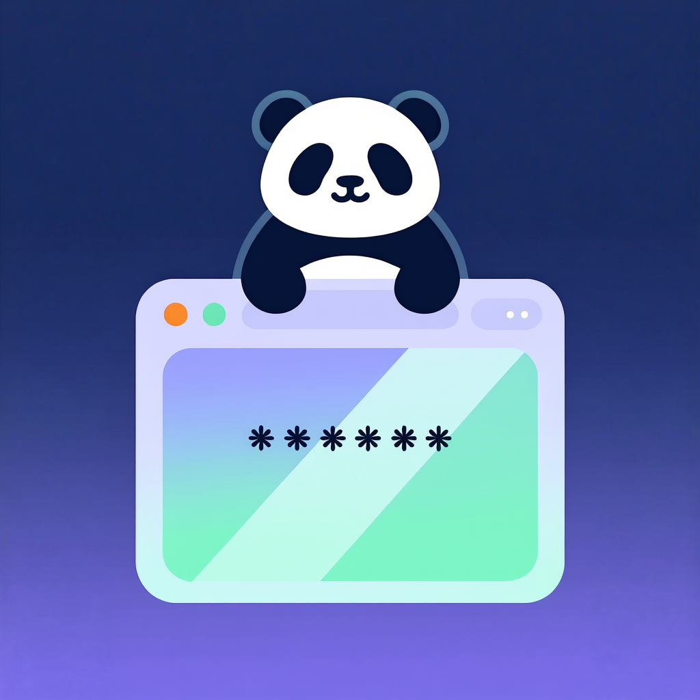

    

# NoPeekPanda - Парольный менеджер с акцентом на безопасность

## 📖 О проекте

NoPeekPanda — это реинкарнация моего предыдущего парольного менеджера "Шрумбрелла", полностью переработанная с акцентом на безопасность и современные практики разработки. Проект в первую очередь преследует учебные цели и в настоящее время **не рекомендуется для использования в production-среде**.

**Текущий статус**: Ранняя стадия разработки. Добавлены темы, базовое управление паролями.

## 🎯 Цели проекта

### Основные цели:
- Изучение передовых практик безопасности в разработке приложений
- Освоение работы с Tauri и системой безопасного хранения Stronghold
- Создание кроссплатформенного приложения с современным UI
- Реализация принципа "минимального времени нахождения секретов в памяти"

### Планируемый функционал:
- ✅ Поддержка тем Catppuccin
- 🔄 Мультиязычный интерфейс (русский/английский)
- ❌~~🔒 Безопасное хранение с использованием Stronghold~~
- ✅ Безопасное хранение с использование SQLCipher
- 🔄 TOTP-аутентификация (в планах)
- 🔄 Синхронизация между устройствами (под вопросом)
- ❌~~🔐 Импорт из предыдущей версии (Shroombrella)~~

## ⚠️ Важное замечание

Этот проект разрабатывается в **учебных целях** и не прошел независимый аудит безопасности. Я не рекомендую использовать его для хранения действительно важных паролей до тех пор, пока не будет достигнута стабильная версия с полной проверкой безопасности.

## 🔄 Изменения по сравнению с ShroomBrella

- Переход с egui на Tauri для улучшенной безопасности
- ~~Внедрение Stronghold для безопасного хранения секретов~~
- Внедрение SQLCipher для безопасного хранения секретов
- Пересмотр архитектуры с акцентом на минимальное время нахождения данных в памяти
- Улучшенная система тем и поддержка нескольких языков
- Более модульная архитектура для легкости расширения
- Отказ от интеграции с облачными хранилищами в первоначальной реализации

## 🗺️ Roadmap

### ✅ Этап 1: Базовая функциональность
- Реализация безопасного хранения паролей
- ~~Интеграция с Stronghold~~
- Использование SQLCipher
- Базовые функции управления паролями

### Этап 2: Безопасность и дополнительные функции
- Реализация TOTP-аутентификации
- Функции импорта/экспорта данных
- Улучшенная система резервного копирования

### Этап 3: Расширенные возможности
- Синхронизация между устройствами (если будет принято решение)
- Дополнительные методы аутентификации
- Плагины и расширения

## 🛠️ Технологический стек

- **Бэкенд**: Rust, Tauri
- **Фронтенд**: JavaScript, Svelte
- **Безопасность**: SQLCipher, zeroize
- **Хранение данных**: Зашифрованный Json с возможным переходом на более серьезные методы хранения
- **UI**: Catppuccin Theme System, полностью настраиваемый интерфейс

## 📦 Установка и запуск

*Инструкции по установке появятся здесь, когда проект достигнет альфа-стадии.*

## 📄 Лицензия

Проект распространяется под двойной лицензией:
- Apache License 2.0
- MIT License

Вы можете выбрать ту лицензию, которая лучше подходит для ваших нужд.

## 💝 Благодарности

Особая благодарность авторам иконок и open-source проектов, чьи работы используются в этом приложении. Подробнее об авторах и лицензиях в [CREDITS.md](CREDITS.md).

## 🤝 Участие в разработке

Так как это учебный проект, я приветствую советы и рекомендации по улучшению безопасности и архитектуры. Однако, учитывая учебный характер проекта, я не ожидаю активного участия сторонних разработчиков на ранних стадиях.

---

*NoPeekPanda находится в активной разработке. Следите за обновлениями!*
